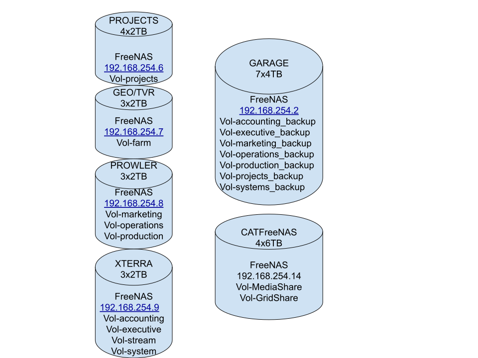

# FreeNAS

The 2cld storage infrastructure pattern uses ZFS storage mounted via NFS, SMB and iSCSI via a FreeNAS server.  Storage allocation, snapshots and recovery are determined via project / customer SLA and maintained through management of ZFS snapshot, replication and rsync tools via the FreeNAS server.

## Grasshorse Storage Infrastructure

1. [projects.gh.lan](https://192.168.254.6) - Production Pipline Project Storage
2. [garage.gh.lan](https://192.168.254.7) - Enterprise storage for ZFS volume replication
3. [CATFreeNAS](https://192.168.254.14) - DeepStorage and Disaster Recovery

### Snapshot, Replication and Recover

1. [projects.gh.lan](https://192.168.254.6)
    1. ZFS Volumes
      - Projects
    2. ZFS Snapshot every 2hrs
    3. ZFS Replication to [garage.gh.lan](https://192.168.254.7) every night starting at 8PM CST
    4. Keep 28 snapshots ?
2. [garage.gh.lan](https://192.168.254.7)
    1. ZFS Volumes
      - Projects (target for ZFS replication)
    2. XFS Snapshot daily at 4pm 

### Reference
- [Lawrence Systems - FreeNAS 11.2 Snapshots / Replication](https://www.youtube.com/watch?v=Ge8eLR2FvDU&list=PLjGQNuuUzvmug2-LMfh43ehP9nt8gmCSf&index=36)
- [Lawrence Systems - How To Backup Your FreeNAS 11.3 Using ZFS Replication](https://www.youtube.com/watch?v=et7JyacV_hA&list=PLjGQNuuUzvmug2-LMfh43ehP9nt8gmCSf&index=5)
- [Fun with ZFS send and receive](https://128bit.io/2010/07/23/fun-with-zfs-send-and-receive/)
- The config instructions for [cat9FreeNAS](./cat9FreeNAS.md) from original 2017-10-26 [cat9FreeNAS google doc](https://docs.google.com/document/d/1kE2nafGL4KOyLlbPjma4ittpz_pkTlQPhcBlV2qrHMU/edit)
