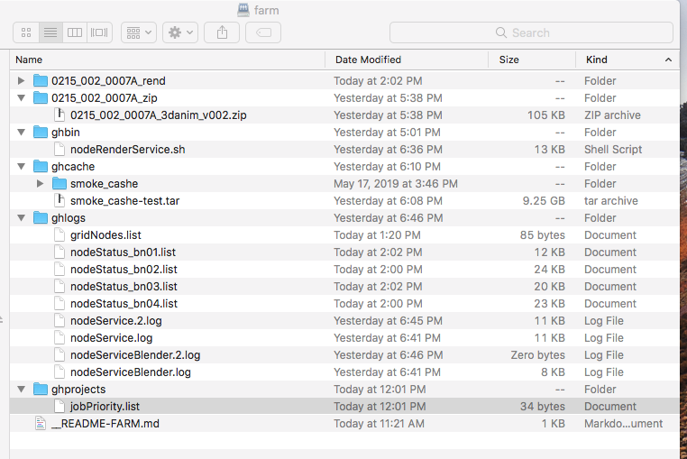
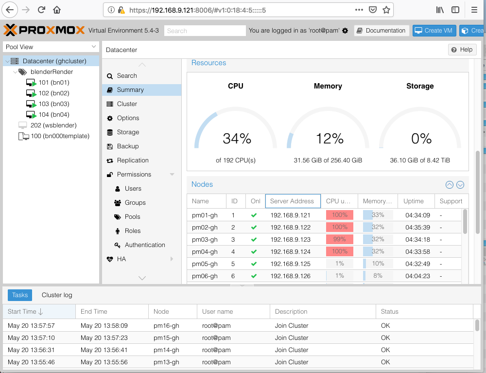
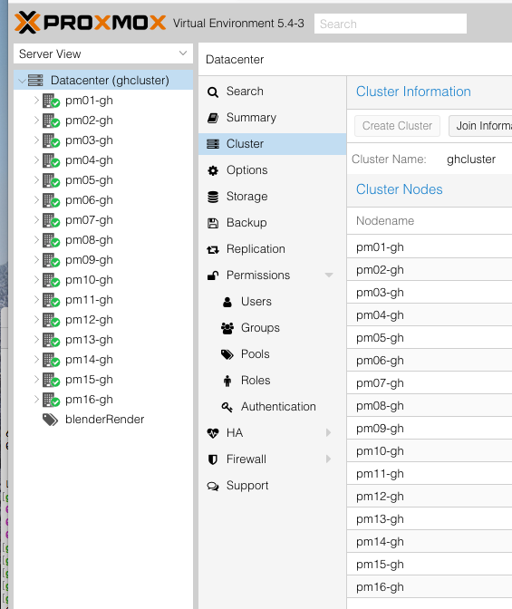

# ghcluster - blenderRender Pool Management

## ghcluster startup

1. Verify ghopsGRIDrouter is on (little black router on back side of grid rack)
2. Turn on ghclusterNAS (freenas box in R4 grid rack ) and wait for clean prompt ~10min ( should say web at 192.168.9.2 )
3. Turn on Grid (botton right 2 breakers) NOTE: ghclusterNAS MUST BE UP or nodes will not be able to boot.
4. All nodes should start-up in a sequence automatically.
5. Nodes will begin to report into /media/farm/ghlogs/gridNodes.list and start rendering via /media/farm/ghprojects/jobPriority.list

## ghcluster debug

### ReferenceNotes

- [ghclusterNAS](http://192.168.9.2/ui/sessions/signin) - root-What#Time
- Render nodes are vm managed by proxmox through /media/farm/ghprojects/jobPriority.list
   - catmini:~ cat$ sudo mount -t nfs 192.168.9.2:/mnt/MediaVolume/farm /private/nfs
      
   - catmini:~ cat$ ssh ghadmin@192.168.9.41
```
ghadmin@bn01:~$ ls /media/farm/gh
ghbin/      ghcache/    ghlogs/     ghprojects/ 
ghadmin@bn01:~$ ls /media/farm/ghprojects/
jobPriority.list
ghadmin@bn01:~$ ls /media/farm/ghlogs/
gridNodes.list  nodeStatus_bn01.list  savelogs
ghadmin@bn01:~$ ls /media/farm/0215_002_0007A_zip/
0215_002_0007A_3danim_v002.zip
ghadmin@bn01:~$ ls /media/farm/0215_002_0007A_rend/0215_002_0007A_3danim_v002.0001.*
/media/farm/0215_002_0007A_rend/0215_002_0007A_3danim_v002.0001.cfg
/media/farm/0215_002_0007A_rend/0215_002_0007A_3danim_v002.0001.lock
ghadmin@bn01:~$ cat /media/farm/ghprojects/jobPriority.list 
0215_002_0007A_rend/*.cfg
ghadmin@bn01:~$ cat /etc/systemd/system/ghrender.service 
[Unit]
Description=ghrender

[Service]
ExecStart=/home/ghadmin/nodeRenderService.sh

[Install]
WantedBy=multi-user.target
ghadmin@bn01:~$ cat /etc/init.d/ghrendernode 
#!/bin/bash
su ghadmin -c "bash -c '/home/ghadmin/nodeRenderService.sh $1'"

ghadmin@bn01:~$ 
ghadmin@bn01:~$ sudo systemctl status ghrender
● ghrender.service - ghrender
   Loaded: loaded (/etc/systemd/system/ghrender.service; enabled; vendor preset: enabled)
   Active: active (running) since Tue 2019-05-21 14:32:47 UTC; 2h 54min ago
 Main PID: 1134 (nodeRenderServi)
    Tasks: 51 (limit: 4658)
   CGroup: /system.slice/ghrender.service
           ├─1134 /bin/bash /home/ghadmin/nodeRenderService.sh
           └─7717 blender -b /home/ghadmin/0215_002_0007A_3danim_v002.blend -y -F PNG -o /home/ghadmin/0215_002_0007A_3danim_v002.#### -

May 21 17:25:10 bn01 nodeRenderService.sh[1134]: rm: cannot remove '/home/ghadmin/*.cfg': No such file or directory
May 21 17:25:13 bn01 nodeRenderService.sh[1134]: ALSA lib confmisc.c:767:(parse_card) cannot find card '0'
May 21 17:25:13 bn01 nodeRenderService.sh[1134]: ALSA lib conf.c:4528:(_snd_config_evaluate) function snd_func_card_driver returned erro
May 21 17:25:13 bn01 nodeRenderService.sh[1134]: ALSA lib confmisc.c:392:(snd_func_concat) error evaluating strings
May 21 17:25:13 bn01 nodeRenderService.sh[1134]: ALSA lib conf.c:4528:(_snd_config_evaluate) function snd_func_concat returned error: No
May 21 17:25:13 bn01 nodeRenderService.sh[1134]: ALSA lib confmisc.c:1246:(snd_func_refer) error evaluating name
May 21 17:25:13 bn01 nodeRenderService.sh[1134]: ALSA lib conf.c:4528:(_snd_config_evaluate) function snd_func_refer returned error: No 
```
- [Proxmox webui - https://192.168.9.121:8006](https://192.168.9.121:8006/#v1:0:18:3:5::5:7::5) Datacenter -> Summary
    
- [Proxmox webui - https://192.168.9.121:8006](https://192.168.9.121:8006/#v1:0:18:3:5::5:7::5=cluster) Datacenter -> Cluster
    
