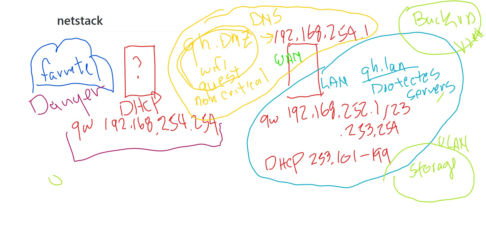

# Overview of pfsense config of gh.lan

## [youtube - gh.lan Overview](https://youtu.be/HJzfB8MpkJg)

1. Review [gh.2cld.net/docs/](http://gh.2cld.net/docs/) [TC 0:56](https://youtu.be/HJzfB8MpkJg?t=56)
2. Talk through existing IP space using doc [TC 3:54](https://youtu.be/HJzfB8MpkJg?t=234)
3. Begin the below drawing [TC 4:33](https://youtu.be/HJzfB8MpkJg?t=273)

4. Show DHCP Lease IP assignment [TC 7:47](https://youtu.be/HJzfB8MpkJg?t=467)
5. Show WAN interface 192.168.254.1 DNS Server [TC 10:06](https://youtu.be/HJzfB8MpkJg?t=606)
6. Discribe the 2 network LAN pools old - 192.168.254.0/24 and new - 192.168.252.0/23 [TC 11:15](https://youtu.be/HJzfB8MpkJg?t=675)
7. Why we are layering to gain control and future VLANs [TC 12:28](https://youtu.be/HJzfB8MpkJg?t=748)
8. Show pfsense interfaces WAN and LAN [TC 16:42](https://youtu.be/HJzfB8MpkJg?t=1002)
9. Show pfsense WAN firewall rules [TC 18:51](https://youtu.be/HJzfB8MpkJg?t=1131)
10. Show pfsense LAN firewall rules [TC 19:31](https://youtu.be/HJzfB8MpkJg?t=1171)
11. pfsense Dashboard widgets [TC 22:56](https://youtu.be/HJzfB8MpkJg?t=1376)
12. pfsense Screens Walkthrough [TC 24:00](https://youtu.be/HJzfB8MpkJg?t=1440)
13. pfsense DHCP Server [TC 28:39](https://youtu.be/HJzfB8MpkJg?t=1719)
14. pfsense DNS Server [TC 30:43](https://youtu.be/HJzfB8MpkJg?t=1843)
15. pfsense DNS Host Overrides [TC 32:54](https://youtu.be/HJzfB8MpkJg?t=1974)
16. pfSense DHCP MAC to IP Mappings [TC 33:55](https://youtu.be/HJzfB8MpkJg?t=2035)
17. Change document gateway IP to netstack standard [TC 36:08](https://youtu.be/HJzfB8MpkJg?t=2168)
18. Review Network Traffic using Diagram [TC 33:04](https://youtu.be/HJzfB8MpkJg?t=2284)
19. Add sg.gh.lan DNS entry [TC 39:59](https://youtu.be/HJzfB8MpkJg?t=2399)
20. Add ng.gh.lan DNS entry [TC 43:25](https://youtu.be/HJzfB8MpkJg?t=2605)
21. Go through a DHCP MAC resolution to IP to DNS [TC 48:27](https://youtu.be/HJzfB8MpkJg?t=2907)
22. Debug sg.gh.lan DNS name resolution [TC 56:00](https://youtu.be/HJzfB8MpkJg?t=3360)

-----

0. [TC tbd]()
1. [TC tbd]()
2. [TC tbd]()
3. [TC tbd]()
4. [TC tbd]()
5. [TC tbd]()
6. [TC tbd]()
7. [TC tbd]()
8. [TC tbd]()
9. [TC tbd]()
