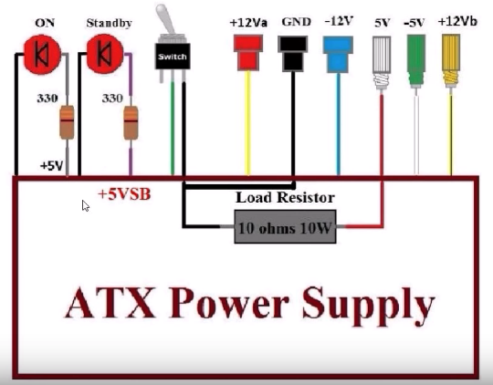
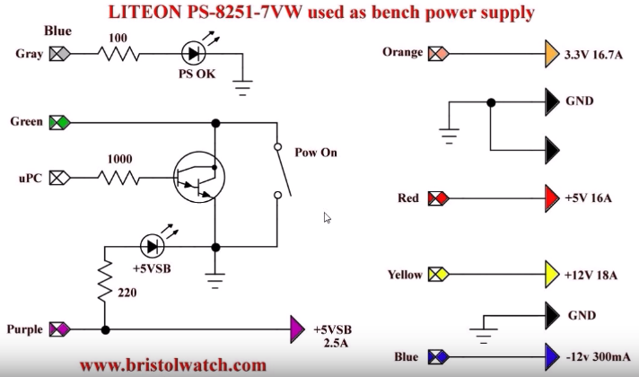
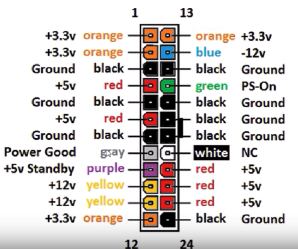
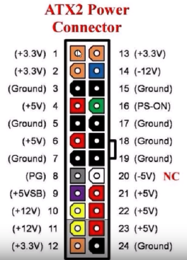

# Test of Raspberry Pi 5 cluster

- Based on [edgelab.digital](https://github.com/digitalrebar/edgelab)

## Power setup
1. 3.0A for Raspberry Pi 4 Model B (2.5A for B+) [pi-power](https://www.raspberrypi.org/documentation/faqs/#pi-power)
2. 60W = 3A x 5V x 4 rpi4 5V Power source for stack
3. 20A @ 5V so an old PC ATX Power supply would work.

## Mechanical setup
1. Use a [4 cluster case](https://www.amazon.com/gp/product/B07CTG5N3V/ref=ppx_yo_dt_b_asin_title_o00_s00?ie=UTF8&psc=1)
2. Use a [8 port TPLink TL-SG108E](https://www.amazon.com/gp/product/B00K4DS5KU/ref=ppx_yo_dt_b_search_asin_title?ie=UTF8&psc=1)

## Schematics

## Notes:
- [CircuitPython](https://en.wikipedia.org/wiki/CircuitPython)
- [LiPo SHIM rpi lithuium ion battery pack shim](https://shop.pimoroni.com/products/lipo-shim)
- [ATX Standards](https://en.wikipedia.org/wiki/Power_supply_unit_(computer))
- [ATX Bench Supply Tutorial](https://www.youtube.com/watch?v=n_A-jkpjpcM)
   - [ATX Power Supply pinout](https://youtu.be/n_A-jkpjpcM?t=768)
   - [Patch Panel wire diagram](https://youtu.be/n_A-jkpjpcM?t=1360)
   - [Volt Amp Meter wire diagram](https://youtu.be/n_A-jkpjpcM?t=2157)
- [ATX Power Supply](https://www.youtube.com/watch?v=UiaqnFYK6SE)
   
### My issues with edgelab-demo
- [EEProm on fresh rpi4](https://github.com/digitalrebar/edgelab/issues/9)
- [Missing rpi4 iso on default](https://github.com/digitalrebar/edgelab/issues/10)
